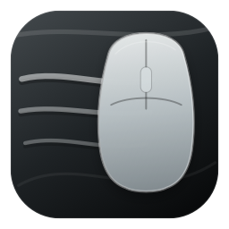
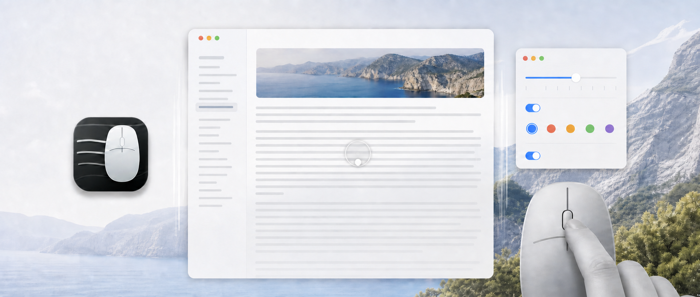
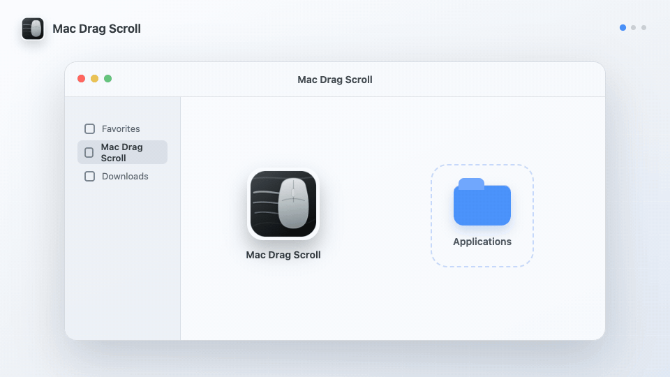
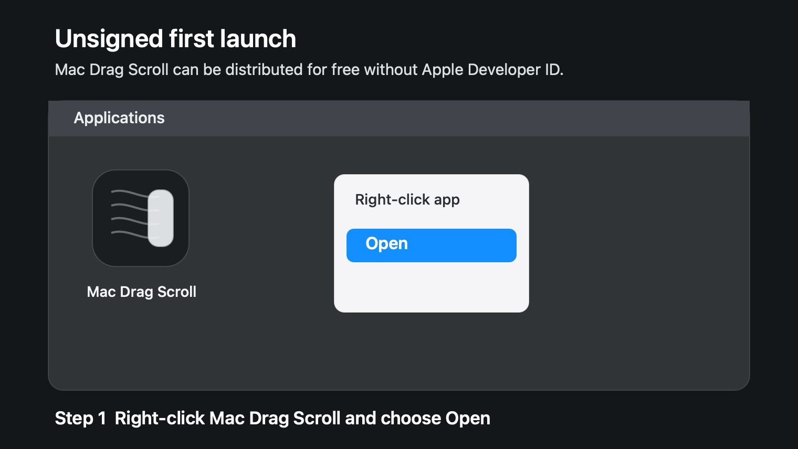
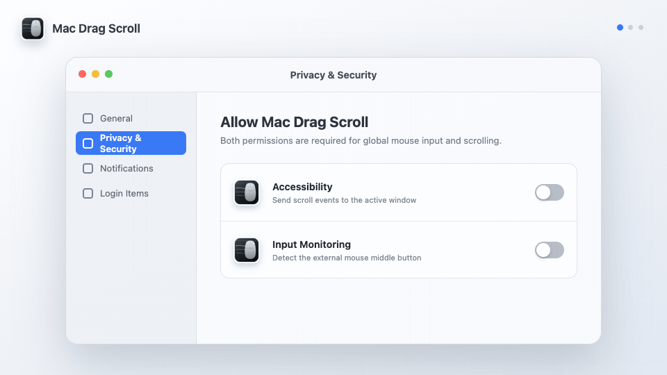
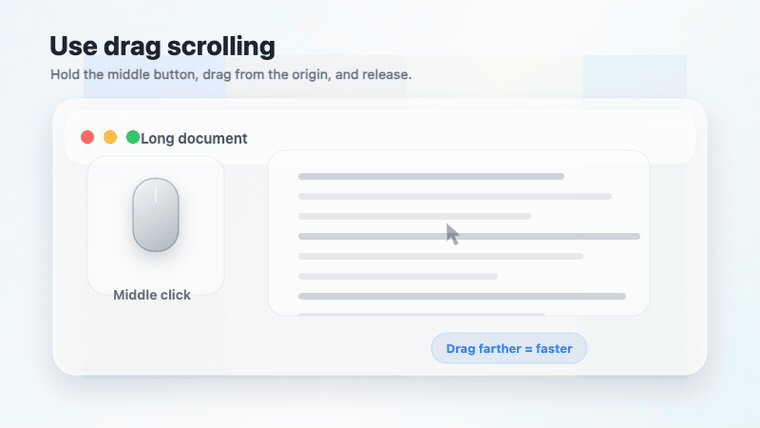

<p align="center">
  
</p>

<h1 align="center">Mac Drag Scroll</h1>

<p align="center">
  <strong>macOSの外部マウスで、Windows風のドラッグスクロールを使えるようにします。</strong>
</p>

<p align="center">
  マウスの中ボタンを押したまま動かすだけで、ホイールに触れずに好きな方向へスクロールできます。
</p>

<p align="center">
  <a href="https://github.com/martincalander/MacDragScroll/actions/workflows/ci.yml"></a>
  <a href="https://github.com/martincalander/MacDragScroll/releases/latest"></a>
  
  <a href="LICENSE"></a>
</p>

<p align="center">
  
</p>

<p align="center">
  <a href="https://github.com/martincalander/MacDragScroll/releases/latest"><strong>最新リリースをダウンロード</strong></a>
</p>

<p align="center">
  <a href="README.md">English</a> | 日本語 | <a href="README.zh-Hans.md">简体中文</a>
</p>

## 機能

Mac Drag Scrollは、Windowsでおなじみの中クリックドラッグスクロールをmacOSに追加します。外部マウスを使い、長いページ、コードエディタ、スプレッドシート、デザインキャンバス、チャットアプリを快適にスクロールしたい人向けのアプリです。

- **押したままドラッグしてスクロール**: マウスの中ボタンを押し、スクロールしたい方向へ動かします。
- **全方向に対応**: 同じジェスチャーで縦、横、斜めにスクロールできます。
- **元のウィンドウを維持**: ドラッグを開始したウィンドウにスクロールを送り続けます。
- **小さなLiquid Glassインジケーター**: ドラッグの開始位置と引っ張っている距離を、控えめな原点マーカーで表示します。
- **メニューバー常駐**: バックグラウンドで動作し、Dockを散らかしません。
- **安全性を重視**: トラックパッドジェスチャーを避け、設定したマウストリガーだけを監視します。

## インストール

推奨:

```sh
brew install --cask martincalander/tap/mac-drag-scroll
```

手動インストール:

1. [最新リリース](https://github.com/martincalander/MacDragScroll/releases/latest)を開きます。
2. `MacDragScroll.dmg`をダウンロードします。
3. ディスクイメージを開き、**Mac Drag Scroll**をアプリケーションフォルダへ移動します。
4. 初回起動時のみ: Finderで**Mac Drag Scroll**を右クリックし、**開く**を選んで確認します。
5. macOSに求められたら、アクセシビリティと入力監視のアクセスを許可します。

<p align="center">
  
</p>

現在のリリースは署名およびAppleの公証を受けていないため、初回起動時にmacOSがブロックする場合があります。これは無料のリリースフローでは想定される動作です。ダウンロードしたビルドごとに、右クリックして**開く**操作を一度だけ行えば使用できます。

<p align="center">
  
</p>

Homebrewを使わないCLIインストール:

```sh
curl -fsSL https://github.com/martincalander/MacDragScroll/raw/main/install.sh | bash
```

## 権限を許可する

Mac Drag Scrollがグローバルにマウスの中ボタンを検出し、スクロールイベントを送信するには、アクセシビリティと入力監視の権限が必要です。

1. **システム設定**を開きます。
2. **プライバシーとセキュリティ**へ移動します。
3. **アクセシビリティ**を開き、**Mac Drag Scroll**を有効にします。
4. **入力監視**を開き、**Mac Drag Scroll**を有効にします。
5. macOSに再起動を求められた場合は、Mac Drag Scrollを終了して開き直します。

<p align="center">
  
</p>

アプリの設定画面には権限の状態が表示されます。必要な権限のどちらかが削除されると、ドラッグスクロールは無効になります。

## 使い方

1. マウスの中ボタンを押したままにします。
2. 開始位置からマウスを動かします。
3. マウスの中ボタンを離すと停止します。

<p align="center">
  
</p>

原点から遠くへドラッグするほどスクロール速度が上がります。設定でオフにしない限り、ドラッグ中は小さなガラス風インジケーターが表示されます。

## 設定

メニューバーアイコンから設定を開きます。

| 設定 | 変更内容 |
| --- | --- |
| Enable | Mac Drag Scrollのオンとオフを切り替えます。 |
| Keep in Menu Bar | 設定画面を閉じたあともメニューバーで動作を続けます。 |
| Speed | スクロール速度を調整します。 |
| Acceleration | 遠くへドラッグしたときの速度の上がり方を変更します。 |
| Dead zone | スクロールが始まらない原点周辺の小さな範囲を設定します。 |
| Visualizer | サイズ、不透明度、色合い、Liquid Glassの強さ、アニメーションを調整します。 |
| Launch at Login | サインイン時にMac Drag Scrollを自動起動します。 |
| Excluded Apps | 選択したアプリではドラッグスクロールを無効にします。 |
| Permissions | アクセシビリティと入力監視の状態を表示し、修復用の操作を提供します。 |
| Updates | SparkleでGitHub Releasesを確認し、バージョン履歴を表示します。 |

設定はmacOSユーザーごとに次の場所へ保存されます。

```text
~/Library/Preferences/com.martincalander.macdragscroll.plist
```

復元できるアプリ設定は、次のバックアップにもミラーされます。

```text
~/Library/Application Support/Mac Drag Scroll/Preferences.plist
```

通常のアプリ削除、再インストール、Homebrewアップグレード、Sparkleアップデートではこれらのファイルは削除されないため、設定はアップデートやアンインストール後も残ります。

## 診断

アプリがクラッシュした場合、設定画面に**Crash Reports**セクションが表示されます。そこからフォルダを開く、最新レポートをコピーする、最新レポートをFinderで表示する、保存済みレポートを削除する、といった操作ができます。

クラッシュレポートはローカルの次の場所に保存されます。

```text
~/Library/Application Support/Mac Drag Scroll/Crash Reports
```

## プライバシー

Mac Drag Scrollはローカルで動作するユーティリティとして設計されています。ドラッグスクロールジェスチャーのためにアクセシビリティと入力監視へのアクセスが必要ですが、入力内容を記録したり、文書の内容を調べたり、閲覧履歴を追跡したりすることはありません。

詳しくは[プライバシーに関する説明](PRIVACY.md)を読んでください。

## アップデート

新しいバージョンは、**設定 -> アップデート**またはメニューバーの**アップデートを確認**から確認できます。アップデートはSparkleで検証され、GitHub Releasesで配布されます。今後のリリースで明記されない限り、このアプリはAppleの公証を受けていません。

## サポート

困ったときはまず[サポート](SUPPORT.md)を確認し、再現できる問題であればIssueを作成してください。

## 要件

- macOS 26.2以降
- 中ボタンまたはスクロールホイールクリックを備えた外部マウス
- アクセシビリティと入力監視の権限

## 作者

Mac Drag Scrollは[Martin Calander](https://martincalander.com)が制作しています。

開発者やコントリビューターは[Contributing](CONTRIBUTING.md)を読んでください。

リリース担当者は[Releasing](docs/RELEASING.md)を読んでください。
